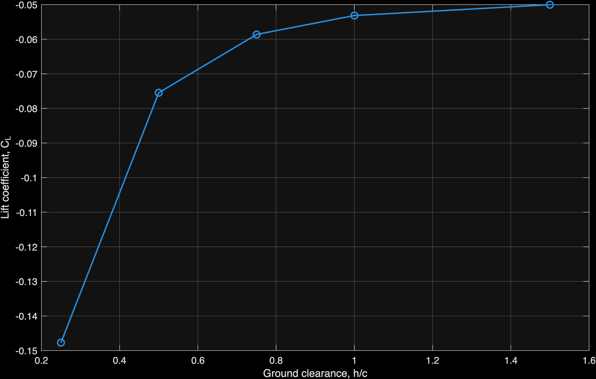
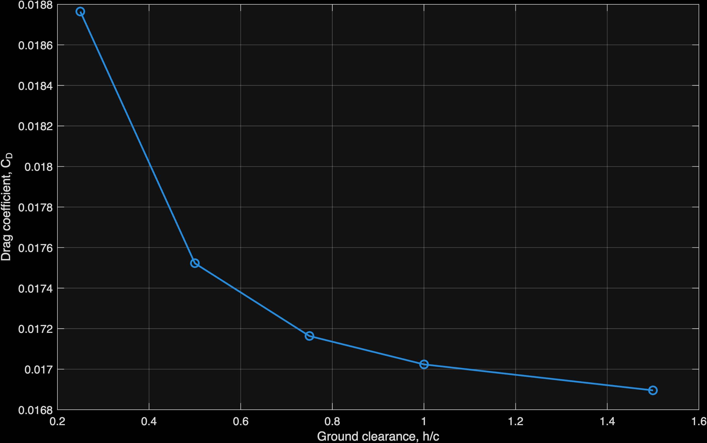
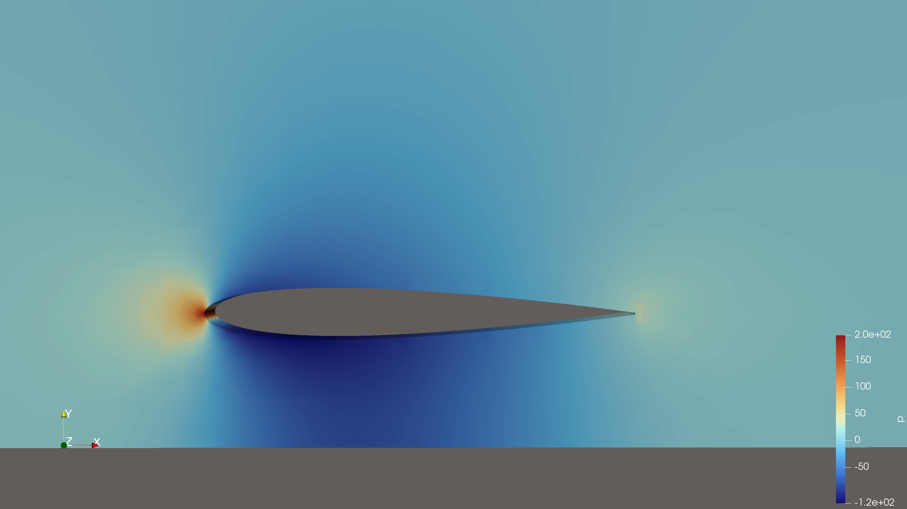
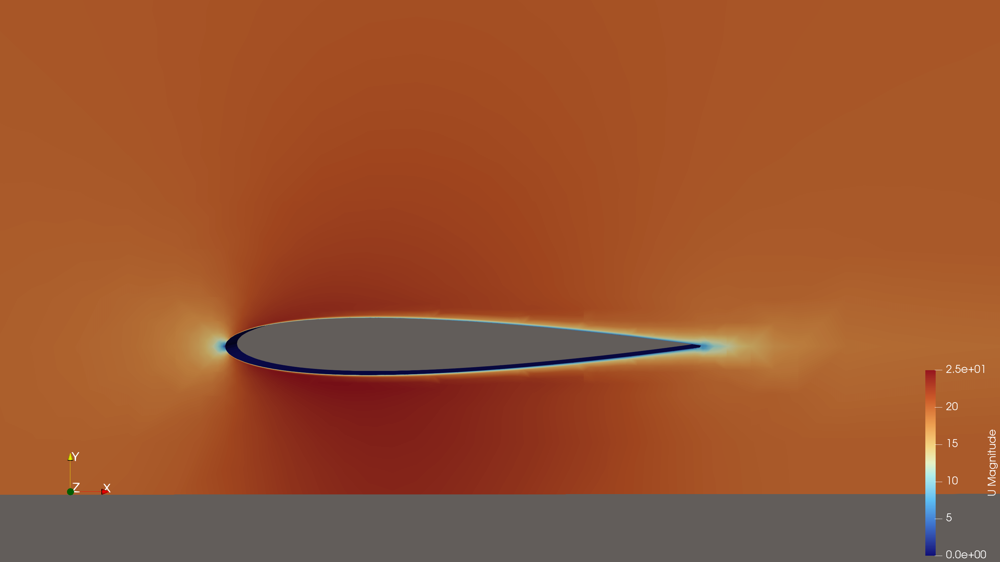

# Formula Student Front Wing CFD Study

Independent OpenFOAM CFD project investigating the aerodynamics of a simplified Formula Student front-wing section, with particular focus on **ground effect, mesh sensitivity, near-wall resolution and reproducible parametric simulation**.

The project is being developed progressively from a quasi-2D NACA 0012 model towards a future 3D front-wing and endplate investigation.

---

## Project Objectives

The objectives of this project are to:

- Develop a reproducible CFD workflow in OpenFOAM.
- Investigate the aerodynamic behaviour of a simplified Formula Student front-wing section.
- Assess mesh sensitivity and near-wall prism-layer behaviour.
- Investigate the effect of wing-to-ground clearance on aerodynamic forces.
- Maintain consistent local mesh resolution across parametric cases.
- Automate repetitive geometry and case-generation tasks using Python.
- Post-process aerodynamic results using MATLAB and ParaView.
- Extend the methodology towards a future 3D front-wing and endplate study.

---

## Current Status

### Completed

- Parametric NACA 0012 geometry generation in Python
- Geometry validation against reference data
- STL generation
- Baseline `blockMesh` / `snappyHexMesh` workflow
- Baseline steady-state RANS simulation
- Mesh-quality assessment using `checkMesh`
- Initial mesh-sensitivity investigation
- Prism-layer development and diagnostics
- Near-wall `y+` assessment
- Ground-effect mesh redesign
- Automated generation of five ground-clearance cases
- Five ground-effect CFD simulations
- Force-coefficient stability assessment
- MATLAB aerodynamic trend plots
- ParaView velocity and pressure-coefficient visualisation

### Ongoing / Planned

- Full 3D front-wing geometry
- Endplate geometry investigation
- 3D vortex-structure analysis
- Further mesh refinement
- Experimental or published-data validation where suitable reference data are available

---

# 1. Baseline CFD Simulation

A baseline steady-state CFD simulation was performed for a NACA 0012 airfoil using OpenFOAM `simpleFoam` and the Spalart–Allmaras RANS turbulence model.

## Simulation Conditions

| Parameter | Value |
|---|---:|
| Airfoil | NACA 0012 |
| Chord, `c` | 0.20 m |
| Freestream velocity | 20 m/s |
| Angle of attack | 0° |
| Kinematic viscosity | 1.5 × 10⁻⁵ m²/s |
| Reynolds number | ≈ 2.67 × 10⁵ |
| Solver | `simpleFoam` |
| Flow model | Steady incompressible RANS |
| Turbulence model | Spalart–Allmaras |
| Pressure–velocity coupling | SIMPLE |

The model uses a thin 3D computational domain with spanwise symmetry-plane boundary conditions to approximate quasi-2D flow.

---

## Baseline Mesh

The original baseline mesh contained approximately:

**181,880 cells**

The mesh passed `checkMesh`.

| Mesh metric | Value |
|---|---:|
| Maximum non-orthogonality | 62.64° |
| Average non-orthogonality | 3.60° |
| Maximum skewness | 2.98 |
| Maximum aspect ratio | 16.02 |

---

## Baseline Convergence

The baseline solution converged after:

**566 SIMPLE iterations**

Runtime on an Apple M4 MacBook Pro using OpenFOAM inside Docker was approximately:

**235 seconds**

---

## Baseline Aerodynamic Results

| Coefficient | Result |
|---|---:|
| Lift coefficient, `CL` | 0.00185 |
| Drag coefficient, `CD` | 0.01673 |
| Pitching moment coefficient, `Cm` | -0.000929 |

The near-zero lift coefficient is consistent with the expected symmetric behaviour of a NACA 0012 airfoil at 0° angle of attack.

The drag coefficient consisted approximately of:

- Pressure contribution: `0.01140`
- Viscous contribution: `0.00533`

---

## Baseline Near-Wall Resolution

The original baseline mesh produced the following airfoil-surface `y+` values:

| y+ metric | Value |
|---|---:|
| Minimum | ≈ 15.0 |
| Maximum | ≈ 195.9 |
| Average | ≈ 63.9 |

The wide `y+` range indicated that the original mesh required improved near-wall treatment before stronger aerodynamic conclusions, particularly for drag, could be drawn.

This motivated the subsequent prism-layer development.

---

# 2. Mesh Sensitivity and Prism-Layer Development

A sequence of mesh refinements was investigated before beginning the ground-effect study.

The objective was not only to increase cell count, but to understand how refinement affected:

- Drag prediction
- Lift prediction
- Surface `y+`
- Prism-layer coverage
- Mesh quality

The mesh-sensitivity study showed that absolute drag remained sensitive to refinement.

Therefore, the project does **not** claim formal grid independence.

Instead, later ground-effect cases focus on maintaining a controlled and consistent mesh methodology so that relative aerodynamic trends can be compared more reliably.

---

## Prism-Layer Development

Initial prism-layer testing demonstrated that nominal layer settings did not always produce the intended surface-layer structure.

A successful reference configuration achieved approximately:

- 4 target prism layers
- ≈ 3.88 actual average layers
- ≈ 97.9% layer completion
- `checkMesh`: passed

However, increasing first-layer thickness caused widespread layer rejection in later tests.

This highlighted the importance of checking actual prism-layer generation rather than relying only on input settings or a successful `checkMesh` result.

---

# 3. Ground-Effect Investigation

The next stage investigated the influence of ground clearance on aerodynamic forces.

Five non-dimensional ground-clearance ratios were studied:

- `h/c = 0.25`
- `h/c = 0.50`
- `h/c = 0.75`
- `h/c = 1.00`
- `h/c = 1.50`

Here:

`h` = distance between the lowest point of the airfoil and the ground

`c` = airfoil chord

The wing was kept stationary while the ground was modelled as a moving wall travelling at the freestream velocity.

This represents the wing-fixed reference frame commonly used for ground-effect CFD.

---

# 4. Ground-Effect Mesh Redesign

The initial ground-effect cases revealed an important numerical issue.

Simply moving the lower domain boundary altered the background-mesh arrangement around the airfoil and caused severe inconsistency in prism-layer generation.

Some early cases produced fewer than one effective prism layer on average despite using identical layer settings.

Rather than continuing with inconsistent meshes, a controlled diagnostic process was performed.

The investigation included:

1. Comparison with the original successful layered case
2. Testing castellation and snapping independently from layer addition
3. Confirmation that the underlying snapped mesh remained healthy
4. Identification of prism-layer extrusion as the main failure mechanism
5. Development of a two-block background mesh
6. Preservation of local grid spacing around the airfoil
7. Systematic reduction of physical first-layer thickness

---

## Final Ground-Effect Mesh Strategy

### Fixed upper block

- `y = -0.04 → 1.00 m`
- `Ny = 52`
- `Δy = 0.020 m`

### Variable lower block

- Ground position → `y = -0.04 m`
- Number of cells adjusted to maintain approximately:
  - `Δy ≈ 0.020 m`

### Prism layers

- Target layers: `4`
- `relativeSizes false`
- `firstLayerThickness = 0.00020 m`
- `expansionRatio = 1.2`
- `minThickness = 0.0001 m`

---

## Mesh Consistency

The final five ground-effect meshes produced essentially identical airfoil-layer behaviour:

- Average prism layers: ≈ `3.87 / 4`
- Surface extrusion: ≈ `99.17%`
- Overall layer completion: ≈ `98.1%`
- Illegal faces: `0`
- Maximum non-orthogonality: ≈ `64.46°`
- Maximum skewness: ≈ `1.58`
- `checkMesh`: passed for all cases

This mesh strategy was selected to minimise changes in near-airfoil resolution while the ground clearance was varied.

---

# 5. Ground-Effect CFD Results

All cases were simulated using:

- `simpleFoam`
- Steady incompressible RANS
- Spalart–Allmaras turbulence model
- `U∞ = 20 m/s`
- `Re ≈ 2.67 × 10⁵`

Aerodynamic coefficients reported below are calculated using the **mean of the final 200 SIMPLE iterations**, rather than a single final iteration.

| h/c | Cd | Cl | Average airfoil y+ |
|---:|---:|---:|---:|
| 0.25 | 0.018764 | -0.147688 | 7.277 |
| 0.50 | 0.017522 | -0.075469 | 7.243 |
| 0.75 | 0.017164 | -0.058626 | 7.219 |
| 1.00 | 0.017024 | -0.053152 | 7.206 |
| 1.50 | 0.016895 | -0.050022 | 7.192 |

Under the force-direction convention used in the OpenFOAM cases:

**negative `Cl` represents downforce.**

---

## Ground-Effect Trend

The results show a strongly nonlinear relationship between ground clearance and aerodynamic loading.

From:

`h/c = 0.25 → 1.50`

the magnitude of the lift coefficient decreases by approximately:

**66%**

The strongest change occurs at small ground clearance.

From:

`h/c = 0.25 → 0.50`

the magnitude of `Cl` decreases by approximately:

**49%**

By comparison, the drag coefficient decreases from approximately:

`0.01876 → 0.01690`

corresponding to a reduction of approximately:

**10%**

The results therefore indicate that the strongest ground-effect influence occurs when the wing operates close to the moving ground.

---

## Lift Coefficient vs Ground Clearance

---

## Drag Coefficient vs Ground Clearance

---

# 6. Solver Stability

All five ground-effect cases reached the prescribed maximum of:

**1500 SIMPLE iterations**

The formal residual-control criterion of:

`1 × 10⁻⁵`

was not satisfied for all equations before the maximum iteration count was reached.

Therefore, the simulations are **not described as formally converged based solely on residual criteria**.

However, the aerodynamic force coefficients were highly stable over the final 200 iterations.

| h/c | Cd peak-to-peak variation | Cl peak-to-peak variation |
|---:|---:|---:|
| 0.25 | 0.219% | 0.0081% |
| 0.50 | 0.170% | 0.0035% |
| 0.75 | 0.171% | 0.0011% |
| 1.00 | 0.189% | 0.0040% |
| 1.50 | 0.229% | 0.0005% |

The force coefficients therefore reached stable aerodynamic values even though the formal residual threshold was not achieved.

For this reason, the final reported coefficients use the mean over the final 200 iterations.

---

# 7. Near-Wall Resolution

The final ground-effect cases produced highly consistent airfoil-average `y+` values:

`7.277 → 7.192`

across the complete ground-clearance sweep.

This corresponds to only approximately:

**1.2% variation**

between the smallest and largest ground clearance.

This consistency supports comparison between the five cases because the near-wall resolution on the airfoil remains almost unchanged while the ground position is varied.

However, an average:

`y+ ≈ 7.2`

lies within the buffer-layer region.

The present mesh therefore does not represent either:

- a fully wall-resolved `y+ ≈ 1` approach, or
- a conventional high-`y+` log-layer approach.

This remains a limitation of the current methodology.

---

# 8. Flow Visualisation

ParaView was used to visualise the final CFD fields.

## Velocity Magnitude — h/c = 0.25

The flow accelerates through the restricted wing-ground gap, while a stagnation region forms near the leading edge and a wake develops downstream.

---

## Pressure Coefficient — h/c = 0.25

The pressure field helps explain the strong negative lift coefficient produced at small ground clearance.

---

# 9. Automation and Post-Processing

## Python

Python is used for:

- Geometry generation
- STL preparation
- Ground-clearance case generation
- Automatic modification of OpenFOAM case files
- Consistent generation of multi-block background meshes

The ground-effect generator automatically adjusts:

- Ground location
- Lower-block height
- Lower-block cell count
- Boundary conditions
- Mesh configuration

for each `h/c` value.

---

## MATLAB

MATLAB is used to process aerodynamic results and generate:

- `Cl` vs `h/c`
- `Cd` vs `h/c`

The plotting script is stored in:

`07_postprocessing/matlab/`

---

## ParaView

ParaView is used for:

- Velocity-magnitude contours
- Pressure / pressure-coefficient contours
- Flow-field inspection
- Wake visualisation

ParaView state files are stored in:

`07_postprocessing/paraview/`

---

# 10. Repository Structure

    FS_frontwing_project/
    │
    ├── 01_geometry/
    │
    ├── 02_2D_baseline/
    │
    ├── 03_mesh_independence/
    │
    ├── 04_ground_effect/
    │   ├── generated_multiblock_test/
    │   ├── scripts/
    │   └── old_cases_backup/
    │
    ├── 05_3D_frontwing/
    │
    ├── 06_endplate_study/
    │
    ├── 07_postprocessing/
    │   ├── figures/
    │   │   └── ground_effect/
    │   ├── matlab/
    │   └── paraview/
    │
    ├── results/
    │   ├── ground_effect_summary.csv
    │   ├── baseline_VTK/
    │   └── ground_effect_VTK/
    │
    └── README.md

The folder `03_mesh_independence` retains its original project name, although the current results are more accurately described as a **mesh-sensitivity study** because formal grid independence has not yet been demonstrated.

---

# 11. Tools

- OpenFOAM v2412
- Python
- MATLAB
- ParaView
- Docker
- Git / GitHub

Primary development platform:

- Apple M4 MacBook Pro

---

# 12. Limitations

The current work should be interpreted as a:

**controlled comparative CFD investigation**

rather than a fully validated aerodynamic prediction.

Current limitations include:

- Quasi-2D geometry
- Simplified NACA 0012 wing section
- Zero angle of attack
- Steady RANS modelling
- Spalart–Allmaras turbulence model
- No experimental validation
- Formal grid independence has not yet been demonstrated
- Absolute drag remains sensitive to mesh refinement
- Average airfoil `y+ ≈ 7`
- Formal residual-control criteria were not fully satisfied before 1500 iterations
- Three-dimensional wing-tip and endplate effects are not yet included

For these reasons, the current ground-effect study focuses primarily on **relative aerodynamic trends under a controlled mesh methodology**, rather than claiming validated absolute aerodynamic performance.

---

# 13. Future Work

Planned next stages include:

1. Development of a full 3D Formula Student front-wing geometry
2. Introduction of endplates
3. Parametric endplate geometry variation
4. Investigation of 3D vortex structures
5. Further mesh refinement
6. Improved near-wall resolution
7. Comparison of aerodynamic efficiency between configurations
8. Experimental or published-data validation where appropriate

---

## Author

**Huxford Ren**  
BEng Aerospace Engineering  
University of Birmingham